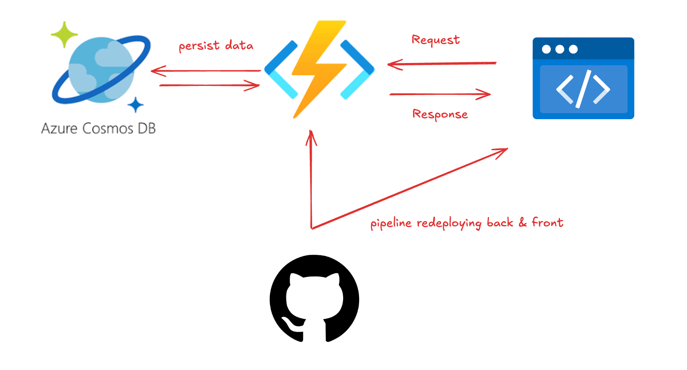
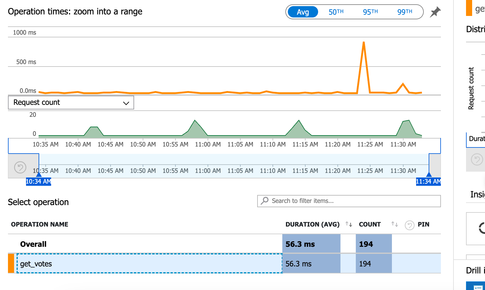
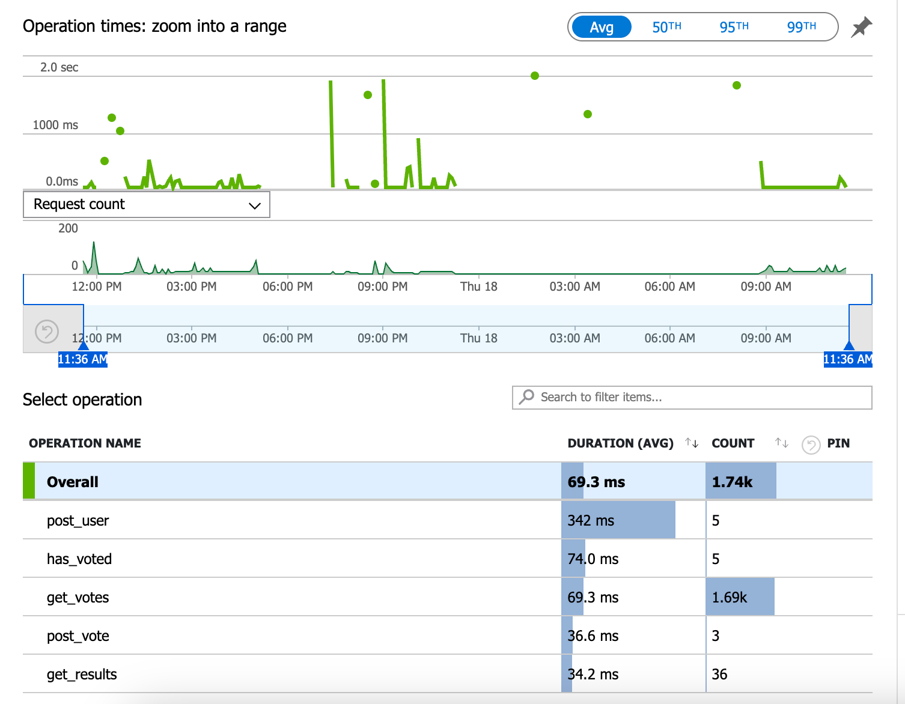

# 🗳️ BayrouMeter – Système de vote Cloud-Native avec Azure

## 🎯 Objectif du projet
BayrouMeter est une **application de sondage en ligne** déployée intégralement sur le cloud Azure.  
Elle permet aux utilisateurs de s’identifier, de voter et de consulter les résultats en temps réel.

Ce projet illustre la mise en pratique de plusieurs concepts Cloud-Native :  
- Développement front-end & back-end **serverless**  
- API via **Azure Functions**  
- Stockage avec **Azure Cosmos DB**  
- Hébergement du front via **Azure Static Web Apps**  
- Pipeline CI/CD avec **GitHub Actions**  
- Supervision et monitoring via **Azure Monitor / Application Insights**

---

## 📜 Cahier des charges

## Endpoints
1. **POST /user** – Crée un utilisateur avec pseudo et email.  
2. **POST /vote** – Enregistre un vote "Oui" ou "Non" pour un utilisateur.  
3. **GET /votes** – Liste tous les votes avec email et choix.  
4. **GET /hasVoted?email=xxx** – Vérifie si un utilisateur a déjà voté.  
5. **GET /results** – Compte le nombre de votes "Oui" et "Non".

### Fonctionnalités principales
1. **Front-end**  
   - Site web statique (React/Vue/HTML+JS) avec :  
     - Identification utilisateur  
     - Vote Oui/Non  
     - Affichage des résultats en temps réel (liste + stats)  
2. **Base de données**  
   - **Azure Cosmos DB** pour stocker utilisateurs et votes.  
3. **Pipeline CI/CD**  
   - Déploiement automatique avec **GitHub Actions** :  
     - Build du front  
     - Tests unitaires du back  
     - Déploiement web + APIs  
4. **Monitoring**  
   - Suivi avec **Application Insights / Azure Monitor** :  
     - Nombre total de votes  
     - Répartition Oui/Non  
     - Nombre d’utilisateurs actifs  
     - Taux d’erreurs et latence API  

---

## 📂 Structure du dépôt

- /frontend → Code du site (React, Vue ou HTML+JS)
- /api → Azure Functions (Node.js ou Python)
- /.github/workflows/ci-cd.yaml → Pipeline GitHub Actions
- /docs → Documentation + captures d’écran KPIs

## 🚀 Déploiement et exécution

### URL du site
https://nice-bay-022b05203.1.azurestaticapps.net/

### URL du back
https://bayrou-azure-functions.azurewebsites.net/

### Exécution locale
1. **Cloner le repo**
   ```bash
   git clone https://github.com/albanledev/bayroumeter.git
   cd bayroumeter

2. **Cloner le repo**
   ```bash
   cd api
   func start

3. **Lancer le front**
   ```bash
   cd frontend
   npm install
   npm run dev

4. **Lancer le front**
   ```bash
   npm run dev


### Schema


- front déployé sur static web apps
- back déployé sur azure functions
- BDD CosmoDB
- la pipeline effectue les tests back et front et les redéploie si tou va bien

### KPIs





